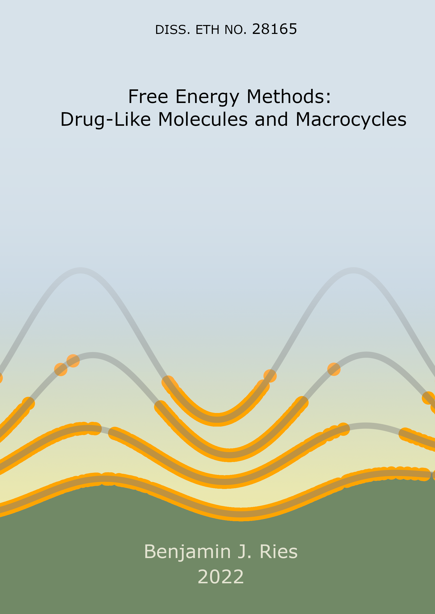

# Thesis: Free Energy Methods: Drug-Like Molecules and Macrocycles
In this project contains:
 * The latex project for the dissertation
 * The Dissertation as .pdf
 * The Dissertation as .pdf without cover page

The Dissertation was published via ETH Zurich Research Collection: https://www.research-collection.ethz.ch/handle/20.500.11850/541613

**Please Cite**:
@thesis{RiesThesis2022,
   title = {Free Energy Methods: Drug-Like Molecules and Macrocycles},
   author = {Benjamin Ries},
   publisher = {ETH Zurich},
   year = {2022},
   url = {https://doi.org/10.3929/ethz-b-000541613},
}

